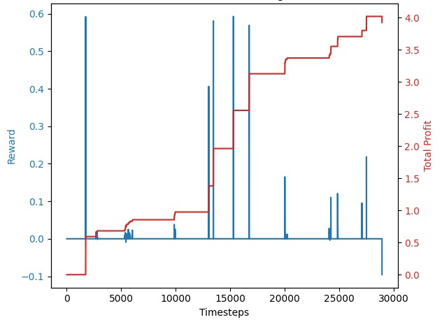
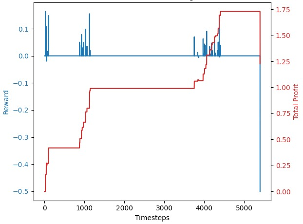

# Trading Bot with Reinforcement Learning

This project demonstrates the development and deployment of a trading bot using Reinforcement Learning (RL) algorithms, specifically A2C (Advantage Actor-Critic) and PPO (Proximal Policy Optimization), implemented with `stable-baselines3`. The bot is designed to trade financial data, using custom-built environments based on OpenAI's `Gym`. The project includes modules for training and validating the model, along with a basic MetaTrader5 (MT5) script for live testing.

## Table of Contents

1. [Project Structure](#project-structure)
2. [Installation](#installation)
3. [Usage](#usage)
    - [Data Preparation](#data-preparation)
    - [Training the Model](#training-the-model)
    - [Validating the Model](#validating-the-model)
4. [Custom Environments](#custom-environments)
    - [CSVTradingEnv](#csvtradingenv)
    - [PositionTradingEnv](#positiontradingenv)
    - [ScalpTradingEnv](#scalptradingenv)
5. [Callbacks](#callbacks)
6. [Images](#images)

## Project Structure

```bash
├── data/
│ ├── train/
│ │ └── DAT_MT_EURUSD_M1_2023.csv
│ ├── val/
│ │ └── DAT_MT_EURUSD_M1_202406.csv
├── environments.py
├── finetune_model.py
├── README.md
├── test_model.py
├── train_model.py
├── trading_bot.py
└── requirements.txt
```

## Installation

```bash
git clone https://github.com/TheAutomators-Git/Forex-Trading-Bot
cd Forex-Trading-Bot
pip install -r requirements.txt
```

## Usage

### Data Preparation

The financial data used for training and validation should be stored in CSV format. The data should contain the following columns: `Open`, `High`, `Low`, `Close`, and `Volume`. The data can be stored in the `data/train/` directory, or in any other directory of your choice. Example:

```python
df = pd.read_csv('data/train/DAT_MT_EURUSD_M1_2023.csv', delimiter=',', header=None, names=['Date', 'Time', 'Open', 'High', 'Low', 'Close', 'Volume'])
df.columns = df.columns.str.lower()
df['datetime'] = pd.to_datetime(df['date'] + ' ' + df['time'])
df.set_index('datetime', inplace=True)
df.drop(['date', 'time'], axis=1, inplace=True)
df[['open', 'high', 'low', 'close', 'volume']] = MinMaxScaler().fit_transform(df[['open', 'high', 'low', 'close', 'volume']])
```

### Training the Model

To train the model, run the `train_model.py` script. The script will train the model using the specified environment and algorithm, and save the trained model to the `models/` directory. The model also has the option to be trained on live data and data from past 20 years using the train_model and finetune_model (to further train on new data) scripts.

### Validating the Model

To validate the model, run the `test_model.py` script. The script will load the trained model and run it on the validation data. The script will output the total reward and profit generated by the model. Can also be tested on live data from MetaTrader5

## Custom Environments

The project includes three custom environments for trading financial data: `CSVTradingEnv`, `PositionTradingEnv`, and `ScalpTradingEnv`, each with varying results. Best configuration for each is commented with the environment classes.

### CSVTradingEnv

This environment is designed for training on historical data stored in CSV files. It supports actions such as holding, buying, or selling based on the closing prices.

### PositionTradingEnv

This environment is used for longer-term position trading. It considers the balance, total profit, and more complex trading strategies like opening and closing positions.

### ScalpTradingEnv

This environment is tailored for scalping strategies, incorporating features like Moving Averages (MA) and Relative Strength Index (RSI) to make quick decisions.

## callbacks

The project includes a custom callback, `RewardAndProfitCallback`, which logs the reward and profit generated by the model during training.

## Images

- The following images show the training and validation results of the model:




- Result from testing the model on the validation data for July 2024:



